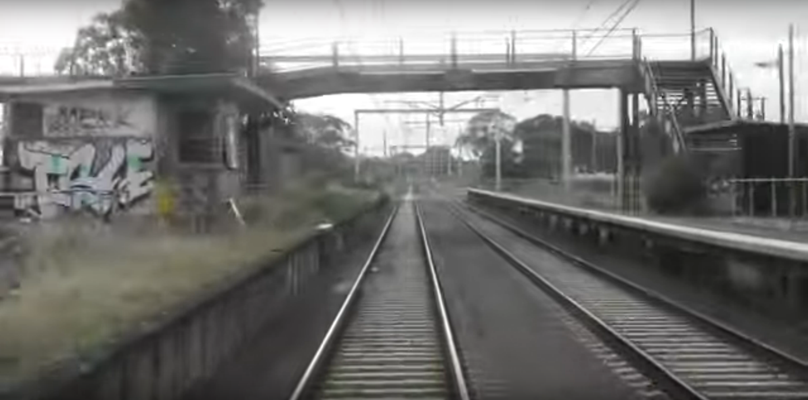
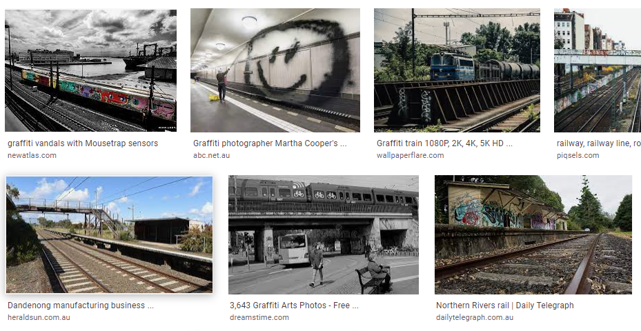
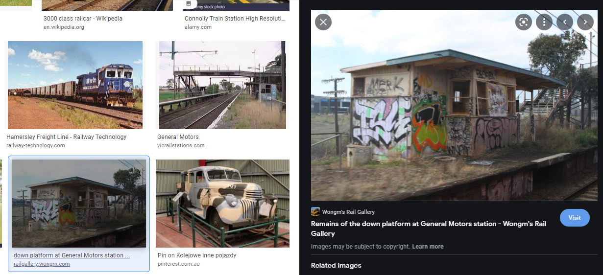

# (back) On the rails

## Category
OSINT

## Points
Dynamically allocated starting at 500, ending at 100

## Description
We intercepted further communications between the two. This text was sent shortly before we lost track of one of the suspects, with an image attached. Can you work out what they're talking about?

Okay, please promise not to judge me, but I might have ended up catching the wrong train again. Though I think I'm still in Australia this time (at least it isn't like that time in Norway LOL). I managed to snap a picture before we went past this station… you have any ideas where I might be?

Please tell us the name of the station, with any spaces replaced by underscores.

Flag format: DUCTF{station_name}

Author: xXl33t_h@x0rXx

Files: `image.png`

## Keywords
OSINT, image search

## Notes
The image we are given is an image of a train station. The description confirms this station is in Australia.



Running `exiftool` gave no location or other information:
```
$ exiftool image.png
ExifTool Version Number         : 11.88
File Name                       : image.png
Directory                       : .
File Size                       : 1215 kB
File Modification Date/Time     : 2021:09:25 10:16:05+01:00
File Access Date/Time           : 2021:09:29 13:06:25+01:00
File Inode Change Date/Time     : 2021:09:25 10:17:24+01:00
File Permissions                : rwxrwxrwx
File Type                       : PNG
File Type Extension             : png
MIME Type                       : image/png
Image Width                     : 1701
Image Height                    : 843
Bit Depth                       : 8
Color Type                      : RGB
Compression                     : Deflate/Inflate
Filter                          : Adaptive
Interlace                       : Noninterlaced
Image Size                      : 1701x843
Megapixels                      : 1.4
```

We'll hold off on steganography tools as we're looking for a location and, with this being OSINT, an image search is more likely.

I uploaded the image to [Google](https://images.google.com/) and [Yandex](https://yandex.com/images/), but, on its own, this yielded no results. Therefore, I added some extra search terms along with the original image. We know that the image is of a train station and that it's in Australia. I tried search terms such as:
* station australia
* train station australia
* abandoned train station australia

Finally, I used the image with the search terms `train station australia graffiti` which yielded the snippet of a search result below, where the bottom-left image looks like it might be our station:



Clicking on the bottom-left image took me to a news article which included the Google search result image with a caption naming it as General Motors station:


To check whether this really was the station we were looking for, I did a Google image search for `General Motors station australia`. This brought up an image that closely matched the original image:



This confirms that the station's name is General Motors, making the final flag `DUCTF{general_motors}`.
