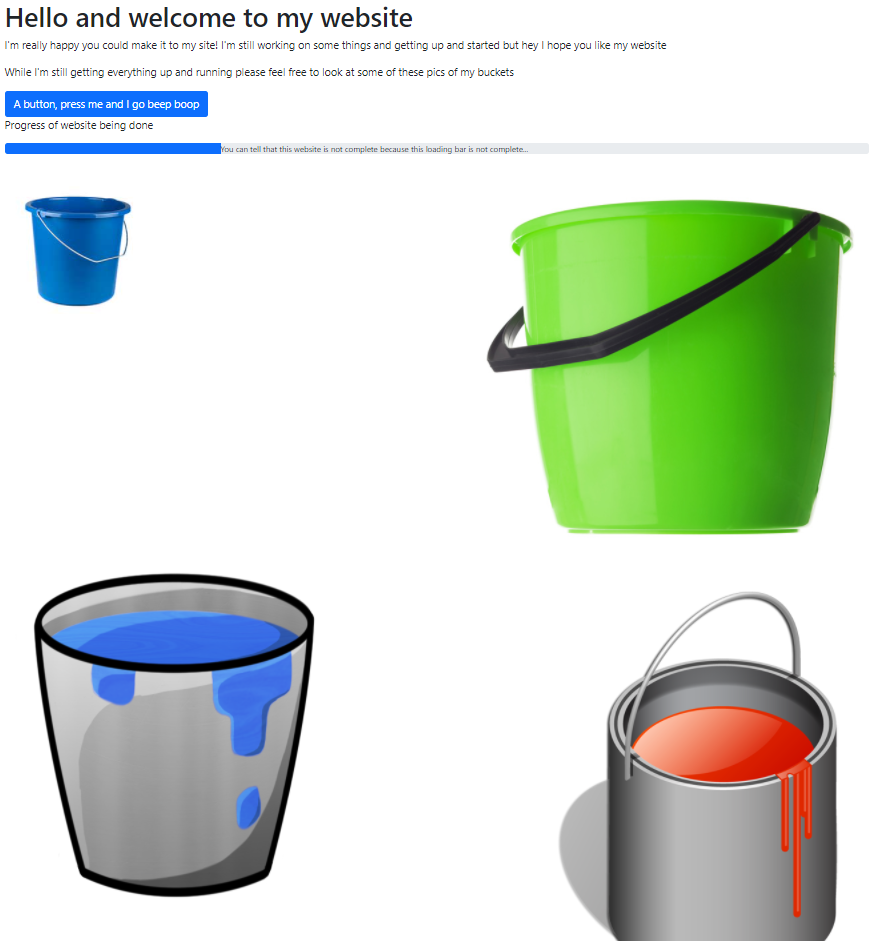

# Bad Bucket

## Category
Cloud

## Points
Dynamic points starting at 500, ending at 100

## Description
Aw yea have you guys SEEN my new website... its nearly done I swear! I've uploaded it to the ☁️CLOUD☁️ and shared it with you guys now so you can see it! Check it out here

Author: Blue Alder

https://storage.googleapis.com/the-bad-bucket-ductf/index.html

## Keywords
Google Buckets, buckets, Google APIs, cloud

## Notes
The link takes us to a website containing some buckets.



I was helped on this by a teammate who told me that the first thing to try with Google Buckets is removing the filename from the end of the URL as this sometimes gives a list of buckets. Therefore, I removed the `index.html` from the URL and it listed the XML:
```xml
<ListBucketResult xmlns="http://doc.s3.amazonaws.com/2006-03-01">
  <Name>the-bad-bucket-ductf</Name>
  <Prefix/>
  <Marker/>
  <IsTruncated>false</IsTruncated>
  <Contents>
    <Key>buckets/.notaflag</Key>
    <Generation>1631512648813277</Generation>
    <MetaGeneration>1</MetaGeneration>
    <LastModified>2021-09-13T05:57:28.814Z</LastModified>
    <ETag>"d66c1be5db93f7b0fd7a63b01f4abeb1"</ETag>
    <Size>158</Size>
  </Contents>
  <Contents>
    <Key>buckets/bucket1.jpg</Key>
    <Generation>1631512648813815</Generation>
    <MetaGeneration>1</MetaGeneration>
    <LastModified>2021-09-13T05:57:28.814Z</LastModified>
    <ETag>"1d258a85b58d749597311350bef1c6bf"</ETag>
    <Size>4695</Size>
  </Contents>
  <Contents>
    <Key>buckets/bucket2.jpg</Key>
    <Generation>1631512648717292</Generation>
    <MetaGeneration>1</MetaGeneration>
    <LastModified>2021-09-13T05:57:28.718Z</LastModified>
    <ETag>"6f0b46412718cbd5b26c1872d8b5bc67"</ETag>
    <Size>62174</Size>
  </Contents>
  <Contents>
    <Key>buckets/bucket3.png</Key>
    <Generation>1631512648816168</Generation>
    <MetaGeneration>1</MetaGeneration>
    <LastModified>2021-09-13T05:57:28.817Z</LastModified>
    <ETag>"1dc92fc30edaba4cba4a08c391f233b7"</ETag>
    <Size>116478</Size>
  </Contents>
  <Contents>
    <Key>buckets/bucket4.png</Key>
    <Generation>1631512648815315</Generation>
    <MetaGeneration>1</MetaGeneration>
    <LastModified>2021-09-13T05:57:28.816Z</LastModified>
    <ETag>"25f754da6b58b49392955c28323bd10a"</ETag>
    <Size>80940</Size>
  </Contents>
  <Contents>
    <Key>index.html</Key>
    <Generation>1631512648715963</Generation>
    <MetaGeneration>1</MetaGeneration>
    <LastModified>2021-09-13T05:57:28.717Z</LastModified>
    <ETag>"2488b950078a002d0e613147209e5d4a"</ETag>
    <Size>1790</Size>
  </Contents>
</ListBucketResult>
```
This lists all the bucket on the site. The first one is called `buckets/.notaflag` which looks promising, so I navigated to that by adding it to the end of the base URL to make a final URL of:

https://storage.googleapis.com/the-bad-bucket-ductf/buckets/.notaflag

This URL gave me a page that displayed:
```
THIS IS A SECRET FILE THAT SHOULD NOT BE SHARED UNDER ANY CIRCUMSTANCE 

jk heres the flag good job!

DUCTF{if_you_are_beggining_your_cloud_journey_goodluck!}
```

This was the flag!