# How to pronounce GIF

## Category
Forensics

## Points
Dynamically allocated starting at 500, ending at 100

## Description
Our machine that makes QR Codes started playing up then it just said "PC LOAD LETTER" and died. This is all we could recover...

Author: xXl33t_h@x0rXx

Files: `challenge.gif`

## Keywords
GIF, GIF frames, QR codes, base64, Python, Pillow/PIL

## Notes
The `challenge.gif` file was an animated GIF that seemed to show sections of a QR code in each frame:


I used Python's [Pillow](https://pypi.org/project/Pillow/) library to get some information from it:
```
$ python3
Python 3.8.5 (default, Jan 27 2021, 15:41:15)
[GCC 9.3.0] on linux
Type "help", "copyright", "credits" or "license" for more information.
>>> from PIL import Image
>>> im = Image.open("./challenge.gif")
>>> im.size
(300, 22)
>>> im.n_frames
120
>>>
```
So we know that there are 120 frames, each of width 300 and height 22.

First I wrote code to extract these into a single image:
```python
from PIL import Image

# Open the image and create a new one to fill with all the frames
im = Image.open("./challenge.gif")
gif_w, gif_h = im.size
new_h = gif_h * im.n_frames
new_im = Image.new("RGBA", (gif_w, new_h), (255,255,255,255))

# Run through the frames and past into the new image
for i in range(0, im.n_frames):
  im.seek(i)
  new_im.paste(im, (0, i*gif_h))

# Save it
new_im.save("full.png")
```
This produced an image that contained each frame stacked separately (here rotated for better display):

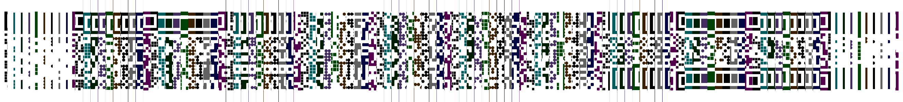

If we take a close look at the bottom of the image (when correctly oriented), we can see there are 10 colours which start to repeat:

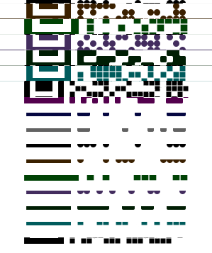

Therefore, we can assume that we have 10 separate QR codes inside the GIF. I rewrote the code to extract the QR codes into 10 different images:
```python
from PIL import Image

# Open the image
im = Image.open("./challenge.gif")

# Get the original size
gif_w, gif_h = im.size

# Create a set of new images to fill
new_ims = []
new_h = gif_h * (im.n_frames // 10)
for i in range(0, 10):
    new_ims.append(Image.new('RGBA', (gif_w, new_h), (255, 255, 255, 255)))

# Go through each frame and insert into the appropriate image
for frame in range(0, im.n_frames, 10):
    for nim in range(0, 10):
        pos = (frame//10) * gif_h
        im.seek(frame+nim)
        new_ims[nim].paste(im, (0, pos))

for nim in range(0,10):
    new_ims[nim].save(f"full{nim}.png")
```
This produced 10 separate QR codes. I tried to use these QR code with a couple of online QR readers, but they couldn't read some of them, so I ended up scanning them off the screen with my phone. Here are the contents:

| QR Code | Resolves to |
| :-----: | :-----      |
| full0  | The princess is in another castle
| full1 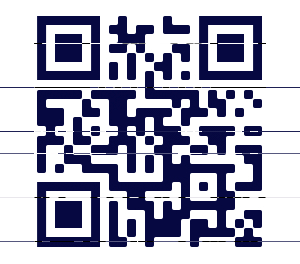 | YouTube video - Jimmy Barnes screaming for 10 hours (https://www.youtube.com/watch?v=gfkts0u-m6w)
| full2 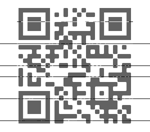 | f0ll0w 7h3 wh173 r4bb17
| full3 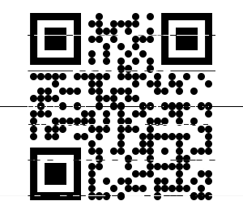 | YouTube video - Rick Astley - Never Gonna Give You Up (Official Music Video) (https://www.youtube.com/watch?v=dQw4w9WgXcQ) :-D
| full4 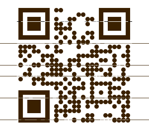 | ASCII art of a rabbit
| full5 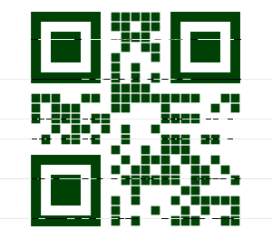 | RFVDVEZ7YU1
| full6 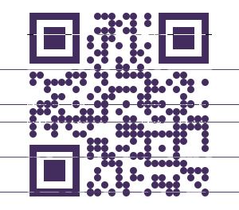 | YouTube video - \[HD\] All Your Base Are Belong To Us (https://www.youtube.com/watch?v=jQE66WA2s-A)
| full7 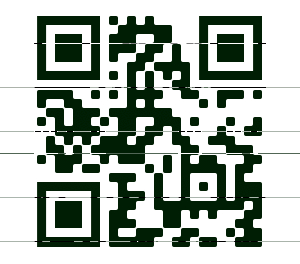 | fMV9oYVhYMHJfbjB3P30=
| full8 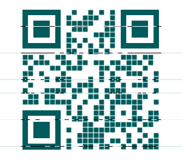 | ASCII art of a rabbit
| full9 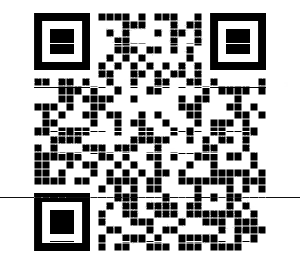 | YouTube video - It's pronounced GIF. (https://www.youtube.com/watch?v=N1AL2EMvVy0)

We can see the `full7.png` image gave us something that looked like `base64`, so I ran it through `base64` to see what it gave us:
```
$ echo fMV9oYVhYMHJfbjB3P30= | base64 -d
|}a`}base64: invalid input
```

OK. So that didn't work. This puzzled me for a while, and I even got a teammate to take a look at my results. Eventually, she realized that `full5.png` was also a `base64` string that gave the start of the flag, but was also invalid:
```
$ echo RFVDVEZ7YU1 | base64 -d
DUCTF{aMbase64: invalid input
```

Combining the two parts, however, gave me the flag:
```
$ echo RFVDVEZ7YU1fMV9oYVhYMHJfbjB3P30= | base64 -d
DUCTF{aM_1_haXX0r_n0w?}
```
